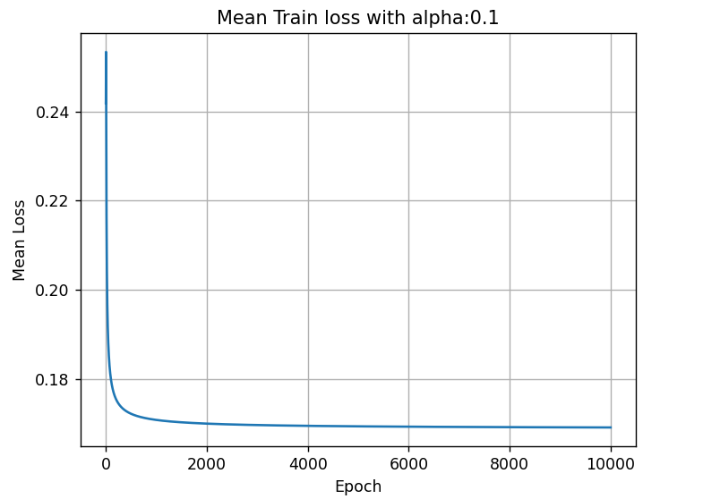

# Informe - Proyecto 2

## Parte 1 - Implementación de la Red Neuronal

Para la implementación de la red neuronal se dividió en dos clases, _Neuron_ y _Layer_.
_Neuron_ se encarga de modelar las Neuronas, en ella residen los pesos de la neurona, los datos recibidos y después de activados, estos 2 últimos utilizados para calcular las gradientes locales y actualizar los pesos.

Por otra parte, _Layer_ se encarga de modelar la capa completa. En ella se guarda una referencia a la capa anterior, a la capa siguiente. En esta clase se maneja todo lo que es la data del entramiento y predicción. Además de manejarse el Backpropagation directamente acá.

Adicionalmente se crearon funciones adicionales para el manejo de la data y obtención de las graficas necesarias.

## Parte 2 - Iris Dataset

El data set contiene 3 tipos de flores, cada una con 4 parámetros numéricos siendo:

- sepal_length
- sepal_width
- petal_length
- petal_width

Cada uno de estos, fue parametrizados para mejor manipulación de los mismos. Además, se cambió la columna de solución por 1 o 0 dependiendo si correspondía a la flor seleccionada, es decir, si íbamos a realizar los análisis del modelo para la flor Iris Setosa, este String sería remplazado por un 1, el resto de los String por un 0.  Las pruebas se realizaron con Alphas (Learning Rate) de 0.1, 0.01 y 0.001, a su vez se probaron con multiples conbinaciones de capas ocultas usando grados de confianza de entre 0.5 a 0.9

## Parte 2.1 - Análisis de los Modelos Binarios

### Planta Iris Setosa

Para las Setosas podemos observar que funcionan mejor el modelo Lineal y el modelo de 1 Capa oculta. Esto se debe a que es muy fácil diferenciarlas del resto del conjunto, es decir, que se puede trazar fácilmente una línea en el espacio que divida las Setosas del resto de las Iris. Todo esto se logra hasta con un 90% de confianza para los modelos de 0 y 1 capa oculta. Con grado de confianza se refiere al porcentaje que se debe alcanzar en el modelo para que se tome como verdadero. Al nosotros usar la función logística o Sigmoidal, esta coloca nuestra respuesta en un valor entre 0 y 1 por lo que al final es necesario transformarla en base a un criterio, siendo este el grado de confianza. Por otra parte, los modelos de 2 capas ocultas poseen una reducción muy drástica a la hora de predecir si es o no una Iris Setosa. Esto puede ser, a que, al ser muy parecido a una función linear, entre más grande a red, más difícil es para esta aproximarla.

En la siguiente tabla se muestran los gráficos para las Setosas con $\alpha = 0.01$ y 90% de confianza.

Escenario|Valores de los resultados|Pérdida media con los casos de prueba|Pérdida media con los casos de entrenamiento
|:-----------:|:--------------------------:|:--------------------------------------:|----------------------------------------------|
1 neurona - 10000 iteraciones| ||
2 neuronas y una capa oculta| ||

### Planta Iris Versicolor

Para las Versicolor, se tiene que lo que funciona mejor es un modelo lineal, es decir, 0 capas ocultas. Es increíble la diferencia en cuanto a las Setosas. La Iris Versicolor necesita alrededor de 60% de grados de confianza para tener comenzar a catalogar lo que deberían ser verdaderos como 1, y aun así posee varios falsos negativos y falsos positivos que se generan debido a esto. Al agregar más capas este rendimiento lo que haces es incluso decrecer más, logrando que incluso un 50% de confianza no sea eficaz.

En la siguiente tabla se muestran los gráficos para las Versicolor con $\alpha = 0.01$ y $\alpha = 0.0001$ respectivamente, con 60% de confianza.

Escenario|Valores de los resultados|Pérdida media con los casos de prueba|Pérdida media con los casos de entrenamiento
|:-----------:|:--------------------------:|:--------------------------------------:|----------------------------------------------|
1 neurona| ||
Dos capas ocultas con 1 y 2 neuronas| ||

### Planta Iris Virginica

Las Virginicas poseen un rendimiento algo mejor que la Versicolor. Esta puede llegar hasta un 70% de grados de confianza tanto en modelos de 0 y 1 capas ocultas. Aunque con esto general un par de falsos positivos en el camino, y no logra reconocer todas las especies correctas. Para hacer esto es necesario bajar el grado de confianza al 50%, a costa de posiblemente duplicar la cantidad de falsos positivos, siendo en el mejor caso encontrado alrededor de 28% de los datos catalogados como Positivos, realmente son negativos.

Iteraciones|Neuronas|Capas|Tasa de aprendizaje|Grado de Confianza|Mínimo del error promedio en entrenamiento|Máximo del error promedio en entrenamiento|Falsos positivos entrenamiento|Falsos negativos en el entrenamiento|Mínimo del error promedio en pruebas|Máximo del error promedio en pruebas|Falsos negativos en pruebas|Falsos positivos en pruebas
|--|--|--|--|--|--|--|--|--|--|--|--|--|
5000|3 neuronas|2 capas|0,1|60%|0,225949102598752|0,252150396197347|7|10|0,235592648743765|0,261797327279251|7|4

Pérdida media con los casos de prueba|Pérdida media con los casos de entrenamiento
|:-----------:|:--------------------------:|
||

### Conclusión

Para las Setosas, se podría decir que son linealmente separables, ya que sin mucho esfuerzo el modelo es capaz de trazar una línea que separe cuales son aquellas plantas que pertenecen a esta categoría y cuales no. Por el contrario, las Virginicas y las Versicolor, en especial esta ultima, es muy complejo para el modelo trazar una línea que las separe completamente del resto. Para las Virginicas se puede conseguir un rendimiento bastante aceptable, pero para las Versicolor, resulta una tarea un poco compleja. Es de acotar que las representaciones funcionan mejor con 0 o 1 capa oculta, esto se debe a que agregarle una cantidad muy grande de capas al modelo causa Overfitting y por eso terminan presetando un rendimiento mucho peor.

## Parte 2.2

A continuación se presentan las tablas con los mejores resultados para el dataset de las plantas:

### Iris Setosa

Número de iteraciones|Número de capas|Neuronas por capa|Tasa de aprendizaje|Grado de Confianza|Mínimo del error promedio en entrenamiento|Máximo del error promedio en entrenamiento|Falsos positivos entrenamiento|Falsos negativos en el entrenamiento|Mínimo del error promedio en pruebas|Máximo del error promedio en pruebas|Falsos negativos en pruebas|Falsos positivos en pruebas
|--|---|---|--|--|--|--|--|--|--|--|--|--|
6000|1|[1]|0,1|0,9|0,0010196569148183|0,175320905282309|0|1|3,71E-05|0,126167726101118|0|0
6000|1|[1]|0,1|0,8|0,0010196569148183|0,175320905282309|0|1|3,71E-05|0,126167726101118|0|0
6000|2|[2-1]|0,1|0,9|0,175512738549472|0,255439800279124|0|0|0,133660794434708|0,277695763501357|0|0
6000|2|[2-1]|0,1|0,8|0,175512738549472|0,255439800279124|0|0|0,133660794434708|0,277695763501357|0|0
2000|3|[2-2-1]|0,001|0,9|0,224625602593234|0,249828624528886|0|41|0,211998356124368|0,249528559814798|9|0
2000|3|[2-2-1]|0,001|0,8|0,224625602593234|0,249828624528886|0|41|0,211998356124368|0,249528559814798|9|0

### Iris Versicolor
Número de iteraciones|Número de capas|Neuronas por capa|Tasa de aprendizaje|Grado de Confianza|Mínimo del error promedio en entrenamiento|Máximo del error promedio en entrenamiento|Falsos positivos entrenamiento|Falsos negativos en el entrenamiento|Mínimo del error promedio en pruebas|Máximo del error promedio en pruebas|Falsos negativos en pruebas|Falsos positivos en pruebas
|--|---|---|--|--|--|--|--|--|--|--|--|--|
6000|1|[1]|0,1|0,5|0,165265932913282|0,234590344190145|11|15|0,193150338216983|0,221354480582585|3|5
6000|1|[1]|0,1|0,6|0,165265932913282|0,234590344190145|9|23|0,193150338216983|0,221354480582585|5|4
6000|1|[1]|0,1|0,7|0,165265932913282|0,234590344190145|9|30|0,193150338216983|0,221354480582585|6|3
6000|2|[3-1]|0,01|0,6|0,221423191923498|0,250058236135671|0|39|0,233156857222187|0,250320673473462|11|0
6000|2|[3-1]|0,01|0,5|0,221423191923498|0,250058236135671|0|39|0,233156857222187|0,250320673473462|11|0
6000|3|[2-2-1]|0,01|0,6|0,212947343353455|0,247557580089668|0|37|0,245554786994436|0,262859940062717|13|0
6000|3|[2-2-1]|0,01|0,5|0,212947343353455|0,247557580089668|0|37|0,245554786994436|0,262859940062717|13|0

### Iris Virginica

Número de iteraciones|Número de capas|Neuronas por capa|Tasa de aprendizaje|Grado de Confianza|Mínimo del error promedio en entrenamiento|Máximo del error promedio en entrenamiento|Falsos positivos entrenamiento|Falsos negativos en el entrenamiento|Mínimo del error promedio en pruebas|Máximo del error promedio en pruebas|Falsos negativos en pruebas|Falsos positivos en pruebas
|--|---|---|--|--|--|--|--|--|--|--|--|--|
15000|1|[1]|0,01|0,5|0,13189508353863|0,249086138807101|11|10|0,0865896766429839|0,247015262834001|2|2
15000|1|[1]|0,01|0,6|0,13189508353863|0,249086138807101|6|13|0,0865896766429839|0,247015262834001|2|1
5000|2|[2-1]|0,1|0,6|0,225949102598752|0,252150396197347|7|10|0,235592648743765|0,261797327279251|7|4
15000|2|[2-1]|0,1|0,6|0,217358670253676|0,252150396197347|7|12|0,235592648743765|0,261797327279251|7|3
2000|3|[2-3-1]|0,001|0,7|0,21886450147712|0,249682021212085|0|39|0,232069514527408|0,249482949505979|11|0
2000|3|[2-3-1]|0,001|0,6|0,21886450147712|0,249682021212085|0|39|0,232069514527408|0,249482949505979|11|0
2000|3|[2-3-1]|0,001|0,5|0,21886450147712|0,249682021212085|0|39|0,232069514527408|0,249482949505979|11|0

### Multiclase

Número de iteraciones|Número de capas|Neuronas por capa|Tasa de aprendizaje|Mínimo del error promedio en entrenamiento|Máximo del error promedio en entrenamiento|Mínimo del error promedio en pruebas|Máximo del error promedio en pruebas|
|--|---|---|--|--|--|--|--|
2000|1|[3]|0,001|0,749838108596152|0,825509252650608|0,749785421415858|0,833875609939017
4000|1|[3]|0,001|0,749838108596152|0,860900928883433|0,749785421415858|0,877261668864227
2000|2|[2-3]|0,1|0,612294158312774|0,731763768153921|0,625763934656319|0,735503791423916
2000|2|[2-3]|0,01|0,612351650596602|0,747829424395707|0,62609083671454|0,746765000542073
2000|3|[2-3-3]|0,1|0,664660823121977|0,72609767704602|0,700325678488476|0,718368188119564
2000|3|[2-3-3]|0,01|0,665133962002301|0,746977616677527|0,700251990769879|0,74524797011359
2000|4|[3-4-3-3]|0,1|0,626836682992001|0,732448543465239|0,651123788368362|0,740527617338157
2000|4|[3-4-3-3]|0,01|0,627012015566329|0,747618525454665|0,651194183629948|0,745290260822085

El identificador múltiple sufre de sobremanera para converger. Se probaron multiples capas, con diferente cantidad de neuronas, y al modelo le cuesta mucho converger, es posible que el problema se deriva en parte de la función de activación usada por el modelo. 

La función sigmoide sirve muy bien para ver si un objeto cae dentro de múltiples categorías, en el dado caso de que se tenga un clasificador múltiple y no uno binario. Sin embargo, en este caso que son opciones excluyentes probablemente se desenvuelva mejor una función de activación _SoftMax_ para conseguir más fácilmente cuál de los 3 resultados es el más viable, y esto podría reducir de gran manera la pérdida media. 

Para los resultados obtenidos, se obtuvo el mejor resultado teniendo solo 1 capa oculta, y este rendimiento tienen un 0.6% de error, bastante alto en general.

### Conclusión
Es de extrañar para nosotros el porque este modelo no converge a unos valores aceptables, aunque podemos asumir que la reducción más grande del error medio de esta, se debe a que es fácil para el modelo separar las setosas del conjunto solución, no tanto como a las otras 2, que le cuesta de sobremanera sin ver ningún punto de mejora. Agregar muchas capas causa _overfitting_ por lo que se debe mantener el modelo entre un rango de 1-2 capas ocultas.

## Parte 3 - Spam dataset

El dataset spam contiene 4601 correos enviados a Hewlett-Packard entre Junio y Julio de 1999. Los datos están organizados por 58 atributos, 57 son variables contínuas y la última es el parámetro que indica si un correo es spam o no.

De los otros 57 atributos, se tiene:

- 48 contienen la frecuencia en la que una _palabra_ específica aparece en un correo, entre todas las palabras del mismo. 
- 6 son para la frecuencia de ciertos caracteres en el correo, como lo son los caracteres `;, (, [ !, $` y `#`.
- 3 variables relacionadas con el conteo de letras mayúsculas en el texto, véase, la longitud más larga, cantidad de cadenas de texto escritas completamente en mayúsculas y cantidad total de letras mayúsculas en el texto.

Se dividió la data en 70% de entrenamiento y 30% para pruebas. La ejecución de los casos de prueba para la parte 3 se realizó de la siguiente manera:

Primero, se ejecutaron 500 épocas con las siguientes variaciones:

- Grado de confianza: 0.70, 0.80, 0.90.
- Alpha: 0.01, 0.0001 y 0.0001.
- Redes de 0, 1 y 2 capas ocultas con 1, 2 y 3 neuronas por capa. Esto es: [1], [1,1], [2,1], [3,1], [1,1,1], [1,2,1], [1,3,1], [2,1,1], [2,2,1], [2,3,1], [3,1,1], [3,2,1] y [3,3,1]

Aquí mostramos las tablas con los resultados (ordenados de menor a mayor en mínimo del error promedio)

Número de iteraciones|Número de capas|Neuronas por capa|Grado de confianza|Tasa de aprendizaje|Mínimo del error promedio en entrenamiento|Máximo del error promedio en entrenamiento|Número de falsos positivos en el entrenamiento|Número de falsos negativos en el entrenamiento|Mínimo del error promedio en pruebas|Máximo del error promedio en pruebas|Número de falsos negativos en pruebas|Número de falsos positivos en pruebas
---|----|---|---|---|---|---|----|----|----|---|-----|---|
500|1|[1]|0,7|0,01|0,085653098963736|0,244898998926552|57|340|0,0931975949695137|0,239835887973255|158|37
500|1|[1]|0,8|0,01|0,085653098963736|0,244898998926552|38|510|0,0931975949695137|0,239835887973255|244|28
500|1|[1]|0,9|0,01|0,085653098963736|0,244898998926552|21|769|0,0931975949695137|0,239835887973255|355|15
500|1|[1]|0,7|0,001|0,136128302311566|0,249455035538964|46|661|0,137367327364459|0,248928435499441|305|16
500|1|[1]|0,8|0,001|0,136128302311566|0,249455035538964|21|1013|0,137367327364459|0,248928435499441|446|6
500|1|[1]|0,9|0,001|0,136128302311566|0,249455035538964|10|1220|0,137367327364459|0,248928435499441|529|3
500|1|[1]|0,7|0,0001|0,21103023155632|0,24994644883431|5|1275|0,211627431186823|0,249891014537458|524|7
500|1|[1]|0,8|0,0001|0,21103023155632|0,24994644883431|0|1285|0,211627431186823|0,249891014537458|528|0
500|1|[1]|0,9|0,0001|0,21103023155632|0,24994644883431|0|1285|0,211627431186823|0,249891014537458|528|0
500|2|[1-1]|0,7|0,01|0,229607311601405|0,250106703065594|37|727|0,236059563567862|0,250628041898208|310|32
500|2|[1-1]|0,8|0,01|0,229607311601405|0,250106703065594|0|1285|0,236059563567862|0,250628041898208|528|0
500|2|[1-1]|0,9|0,01|0,229607311601405|0,250106703065594|0|1285|0,236059563567862|0,250628041898208|528|0
500|2|[2-1]|0,7|0,01|0,231394037202124|0,250186349565281|32|798|0,230584422171646|0,250183969145118|344|26
500|2|[2-1]|0,8|0,01|0,231394037202124|0,250186349565281|0|1256|0,230584422171646|0,250183969145118|557|0
500|2|[2-1]|0,9|0,01|0,231394037202124|0,250186349565281|0|1256|0,230584422171646|0,250183969145118|557|0
500|2|[3-1]|0,7|0,01|0,232175476546941|0,250239168017737|31|884|0,229543018725813|0,250111601777599|398|14
500|2|[3-1]|0,8|0,01|0,232175476546941|0,250239168017737|0|1258|0,229543018725813|0,250111601777599|555|0
500|2|[3-1]|0,9|0,01|0,232175476546941|0,250239168017737|0|1258|0,229543018725813|0,250111601777599|555|0
500|3|[3-2-1]|0,7|0,0001|0,235782228477037|0,249722837820446|0|1228|0,244154523395381|0,249645754216074|585|0
500|3|[3-2-1]|0,8|0,0001|0,235782228477037|0,249722837820446|0|1228|0,244154523395381|0,249645754216074|585|0
500|3|[3-2-1]|0,9|0,0001|0,235782228477037|0,249722837820446|0|1228|0,244154523395381|0,249645754216074|585|0
500|3|[2-2-1]|0,7|0,01|0,237527916931313|0,246978959867377|0|1250|0,241464058236596|0,249376622932001|563|0
500|3|[3-3-1]|0,7|0,0001|0,237703460624215|0,249641329142448|0|1254|0,240914123866108|0,249386502590792|559|0
500|3|[3-3-1]|0,8|0,0001|0,237703460624215|0,249641329142448|0|1254|0,240914123866108|0,249386502590792|559|0
500|3|[3-3-1]|0,9|0,0001|0,237703460624215|0,249641329142448|0|1254|0,240914123866108|0,249386502590792|559|0
500|3|[3-2-1]|0,7|0,01|0,238076745289119|0,24712615082526|0|1259|0,240155179000581|0,247883212409799|554|0
500|3|[3-2-1]|0,8|0,01|0,238076745289119|0,24712615082526|0|1259|0,240155179000581|0,247883212409799|554|0
500|3|[3-2-1]|0,9|0,01|0,238076745289119|0,24712615082526|0|1259|0,240155179000581|0,247883212409799|554|0
500|2|[2-1]|0,7|0,001|0,238143830441008|0,249942152800436|0|1246|0,242394094374383|0,250503822508591|567|0
500|2|[2-1]|0,8|0,001|0,238143830441008|0,249942152800436|0|1246|0,242394094374383|0,250503822508591|567|0
500|2|[2-1]|0,9|0,001|0,238143830441008|0,249942152800436|0|1246|0,242394094374383|0,250503822508591|567|0
500|3|[1-2-1]|0,7|0,01|0,238336911590909|0,247358838054852|0|1261|0,239935851089751|0,247929577309487|552|0
500|3|[1-2-1]|0,8|0,01|0,238336911590909|0,247358838054852|0|1261|0,239935851089751|0,247929577309487|552|0
500|3|[1-2-1]|0,9|0,01|0,238336911590909|0,247358838054852|0|1261|0,239935851089751|0,247929577309487|552|0
500|3|[3-1-1]|0,7|0,0001|0,238356083974239|0,249886189159918|0|1265|0,239161162270085|0,2497802269751|548|0
500|3|[3-1-1]|0,8|0,0001|0,238356083974239|0,249886189159918|0|1265|0,239161162270085|0,2497802269751|548|0
500|3|[3-1-1]|0,9|0,0001|0,238356083974239|0,249886189159918|0|1265|0,239161162270085|0,2497802269751|548|0
500|3|[1-1-1]|0,7|0,0001|0,238673900657826|0,249888090176213|0|1268|0,238852733724163|0,249777255057096|545|0
500|3|[1-1-1]|0,8|0,0001|0,238673900657826|0,249888090176213|0|1268|0,238852733724163|0,249777255057096|545|0
500|3|[1-1-1]|0,9|0,0001|0,238673900657826|0,249888090176213|0|1268|0,238852733724163|0,249777255057096|545|0
500|3|[2-1-1]|0,7|0,0001|0,238681927252506|0,249888809870017|0|1269|0,238646577833463|0,249776569426836|544|0
500|3|[2-1-1]|0,8|0,0001|0,238681927252506|0,249888809870017|0|1269|0,238646577833463|0,249776569426836|544|0
500|3|[2-1-1]|0,9|0,0001|0,238681927252506|0,249888809870017|0|1269|0,238646577833463|0,249776569426836|544|0
500|3|[1-3-1]|0,7|0,0001|0,238699942427816|0,249668859355714|0|1268|0,23888109366879|0,249345057251161|545|0
500|3|[1-3-1]|0,8|0,0001|0,238699942427816|0,249668859355714|0|1268|0,23888109366879|0,249345057251161|545|0
500|3|[1-3-1]|0,9|0,0001|0,238699942427816|0,249668859355714|0|1268|0,23888109366879|0,249345057251161|545|0
500|2|[3-1]|0,7|0,001|0,238848236961116|0,24997549439408|0|1260|0,240558194124828|0,250142105297623|553|0
500|2|[3-1]|0,8|0,001|0,238848236961116|0,24997549439408|0|1260|0,240558194124828|0,250142105297623|553|0
500|2|[3-1]|0,9|0,001|0,238848236961116|0,24997549439408|0|1260|0,240558194124828|0,250142105297623|553|0
500|3|[3-1-1]|0,7|0,01|0,238866864724218|0,245950442994601|0|1274|0,237673580924865|0,244960456628501|539|0
500|3|[3-1-1]|0,8|0,01|0,238866864724218|0,245950442994601|0|1274|0,237673580924865|0,244960456628501|539|0
500|3|[3-1-1]|0,9|0,01|0,238866864724218|0,245950442994601|0|1274|0,237673580924865|0,244960456628501|539|0
500|3|[1-2-1]|0,7|0,001|0,238963204998593|0,248070862229845|0|1272|0,23825668507895|0,246235546672791|541|0
500|3|[1-2-1]|0,8|0,001|0,238963204998593|0,248070862229845|0|1272|0,23825668507895|0,246235546672791|541|0
500|3|[1-2-1]|0,9|0,001|0,238963204998593|0,248070862229845|0|1272|0,23825668507895|0,246235546672791|541|0
500|3|[2-1-1]|0,7|0,001|0,239029174797756|0,249002925693632|0|1275|0,237683676712465|0,247938278942425|538|0
500|3|[2-1-1]|0,8|0,001|0,239029174797756|0,249002925693632|0|1275|0,237683676712465|0,247938278942425|538|0
500|3|[2-1-1]|0,9|0,001|0,239029174797756|0,249002925693632|0|1275|0,237683676712465|0,247938278942425|538|0
500|2|[2-1]|0,7|0,0001|0,239377384139797|0,249773767423523|0|1265|0,240083476358082|0,249564428468988|548|0
500|2|[2-1]|0,8|0,0001|0,239377384139797|0,249773767423523|0|1265|0,240083476358082|0,249564428468988|548|0
500|2|[2-1]|0,9|0,0001|0,239377384139797|0,249773767423523|0|1265|0,240083476358082|0,249564428468988|548|0
500|2|[1-1]|0,7|0,0001|0,239529954898355|0,249882024322775|0|1259|0,241283913342272|0,249785477087316|554|0
500|2|[1-1]|0,8|0,0001|0,239529954898355|0,249882024322775|0|1259|0,241283913342272|0,249785477087316|554|0
500|2|[1-1]|0,9|0,0001|0,239529954898355|0,249882024322775|0|1259|0,241283913342272|0,249785477087316|554|0
500|3|[1-1-1]|0,7|0,001|0,239569163835265|0,249034153711545|0|1282|0,236764400533122|0,247855656769153|531|0
500|3|[1-1-1]|0,8|0,001|0,239569163835265|0,249034153711545|0|1282|0,236764400533122|0,247855656769153|531|0
500|3|[1-1-1]|0,9|0,001|0,239569163835265|0,249034153711545|0|1282|0,236764400533122|0,247855656769153|531|0
500|3|[2-1-1]|0,7|0,01|0,239721161662634|0,246355555703434|0|1285|0,236213441473643|0,243876238894496|528|0
500|3|[2-1-1]|0,8|0,01|0,239721161662634|0,246355555703434|0|1285|0,236213441473643|0,243876238894496|528|0
500|3|[2-1-1]|0,9|0,01|0,239721161662634|0,246355555703434|0|1285|0,236213441473643|0,243876238894496|528|0
500|3|[2-2-1]|0,7|0,01|0,239802152870289|0,248187487713505|0|1285|0,236126718098583|0,245702420926008|528|0
500|3|[2-2-1]|0,8|0,01|0,239802152870289|0,248187487713505|0|1285|0,236126718098583|0,245702420926008|528|0
500|3|[2-2-1]|0,9|0,01|0,239802152870289|0,248187487713505|0|1285|0,236126718098583|0,245702420926008|528|0
500|3|[1-2-1]|0,7|0,0001|0,24022185177956|0,249808036646869|0|1292|0,235469341367567|0,249521200109781|521|0
500|3|[1-2-1]|0,8|0,0001|0,24022185177956|0,249808036646869|0|1292|0,235469341367567|0,249521200109781|521|0
500|3|[1-2-1]|0,9|0,0001|0,24022185177956|0,249808036646869|0|1292|0,235469341367567|0,249521200109781|521|0
500|3|[3-3-1]|0,7|0,01|0,240362212075637|0,249325805686097|0|1292|0,23537302617313|0,247169209526872|521|0
500|3|[3-3-1]|0,8|0,01|0,240362212075637|0,249325805686097|0|1292|0,23537302617313|0,247169209526872|521|0
500|3|[3-3-1]|0,9|0,01|0,240362212075637|0,249325805686097|0|1292|0,23537302617313|0,247169209526872|521|0
500|3|[1-3-1]|0,7|0,001|0,240371911576603|0,247634182352683|0|1294|0,23523258301569|0,244343227052718|519|0
500|3|[1-3-1]|0,8|0,001|0,240371911576603|0,247634182352683|0|1294|0,23523258301569|0,244343227052718|519|0
500|3|[1-3-1]|0,9|0,001|0,240371911576603|0,247634182352683|0|1294|0,23523258301569|0,244343227052718|519|0
500|3|[2-1-1]|0,7|0,01|0,240839262961571|0,247022427284675|0|1303|0,234019952022382|0,242972881054369|510|0
500|3|[2-1-1]|0,8|0,01|0,240839262961571|0,247022427284675|0|1303|0,234019952022382|0,242972881054369|510|0
500|3|[2-1-1]|0,9|0,01|0,240839262961571|0,247022427284675|0|1303|0,234019952022382|0,242972881054369|510|0
500|2|[1-1]|0,7|0,001|0,240994077492833|0,250011186631979|0|1282|0,238685689933838|0,250051827642776|531|0
500|2|[1-1]|0,8|0,001|0,240994077492833|0,250011186631979|0|1282|0,238685689933838|0,250051827642776|531|0
500|2|[1-1]|0,9|0,001|0,240994077492833|0,250011186631979|0|1282|0,238685689933838|0,250051827642776|531|0

De todas estas pruebas realizadas, se seleccionaron las que obtuvieron el mejor gráfico en su convergencia, así como las que obtuvieron la menor suma de falsos positivos y falsos negativos, lo cual indica una buena tasa de aciertos. Estos son:

- 1 neurona, 0.01 de tasa de aprendizaje y 70%, 80% y 90% de grado de confianza
- 1 neurona, 0.001 de tasa de aprendizaje y 70%, 80% y 90% de grado de confianza
- 2 neuronas en dos capas (1,1). Tasa de aprendizaje 0.001 y 0.0001.
- 3 neuronas en dos capas (2,1). Tasa de aprendizaje 0.001 y 0.0001.
- 3 neuronas en tres capas (1,1,1). Tasa de aprendizaje 0.001 y 0.0001
- 4 neuronas en tres capas (1,2,1). Tasa de aprendizaje 0.001 y 0.0001
- 5 neuronas en tres capas (1,3,1). Tasa de aprendizaje 0.001 y 0.0001
- 4 neuronas en tres capas (2,1,1). Tasa de aprendizaje 0.001 y 0.0001
- 7 neuronas en tres capas (3,3,1). Tasa de aprendizaje 0.001 y 0.0001

Algo interesante que observamos es que el modelo con una sola neurona, tiene una convergencia buena para el hecho de tener tan pocas neuronas. A medida que se añaden neuronas el modelo empeora hasta que se llegan a 5 neuronas, cuando el modelo se vuelve a estabilizar y los gráficos dan una mejor convergencia.

Mostramos por ejemplo el caso del entrenamiento de una red neuronal de una sola neurona se comporta mejor que una red de dos neuronas con dos capas, ambas con 80% de grado de confianza, 0.001 de tasa de aprendizaje y 5000 iteraciones:

Una neurona con una capa | Dos neuronas con dos capas |
------|----|
||

Aquí, pasa lo mismo pero con ambas con un 70% de grado de confianza, 0.001 de tasa de aprendizaje y 5000 iteraciones:

Una neurona con una capa | Dos neuronas con dos capas |
------|----|
||

Se puede observar similitudes para estas gráficas.

### Resultados

Todas las ejecuciones realizadas (alrededor de 220) se encuentran registradas en el archivo `outputs.csv`. Este archivo tiene los resultados en el siguiente orden:

- Número de iteraciones
- Número de capas
- Neuronas por capa
- Grado de Confianza
- Tasa de aprendiza ($\alpha$)
- Mínimo del error promedio en entrenamiento
- Máximo del error promedio en entrenamiento
- Número de falsos positivos en el entrenamiento
- Número de falsos negativos en el entrenamiento
- Mínimo del error promedio en pruebas
- Máximo del error promedio en pruebas
- Número de falsos negativos en pruebas
- Número de falsos positivos en pruebas

Para cada experimento realizado, debe incluir tablas con:

* Error promedio, mínimo y máximo en el conjunto de entrenamiento y prueba.

* Cantidad de falsos positivos tanto en el conjunto de entrenamiento como de prueba. Un falso positivo en un clasificador binario es un ejemplo para el que la hipótesis incluye al ejemplo en la categoría clasificada, cuando no pertenece a ella en realidad.

* Cantidad de falsos negativos tanto en el conjunto de entrenamiento como de prueba. Un falso negativo en un clasificador binario es un ejemplo para el que la hipótesis excluye de la categoría clasificada, cuando en realidad sí pertenece a ella. 

Se requiere que realice experimentos para las siguientes topologías:

* Una única neurona, variando la tasa de aprendizaje para hallar la mejor hipótesis.
* Utilizando una capa oculta, variando la tasa de aprendizaje y probando con cuantas neuronas quiera en capa oculta.
* Utilizando dos capas ocultas, siguiendo la misma idea.

Se ra
